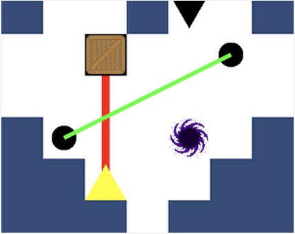

# The Pursuit of Reflection
### *A single-player game built with the Unity Engine*

*Game Design Methodologies Project Autumn 2024*

A game crafted for enthusiasts who enjoy problem-solving and stealth-action challenges.

 ### Objective

The goal is to outmaneuver and chase down the other player within a set number of moves. 
Can you synchronise your movements, anticipate your other player's controller actions, and master the art of coordination to emerge victorious?
With its intuitive gameplay, mind-bending puzzles, and thrilling chase sequences, 
<b> The Pursuit of Reflection </b> will keep you on the edge of your seat as you embark on this dual-player journey of strategy and skill.
Are you ready to lead your way to triumph?

### Team - Contributors

* Kimleng Thai - 24577494 : Level 1.x

* Stephen Khumlamphai - 13802172 : Level 2.x

* Benedict Tannous - 24663041 : Level 3.x

* Aymeric Pierre Frederic Christophe Conti - 25061716 : Level 4.x

### Player Movement

A / Left : Move left

W / Up : Move up 

S / Down : Move down 

D / Right : Move right

### Game Features

* Intuitive gameplay

* Mind-bending puzzles

* Thrilling chase sequences

* Beautifully designed levels

* Engaging sound effects and music

### Video Trailer

* https://youtu.be/YxEISfnZA5k
